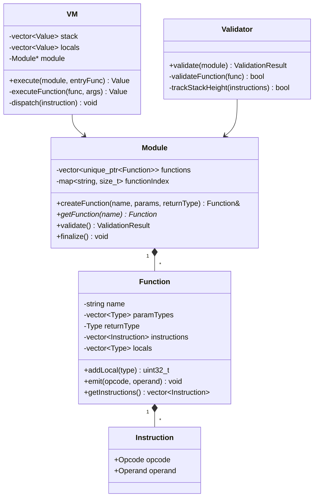

# BeVM Design Document

## Overview

BeVM is a lightweight stack-based virtual machine with a C/C++ code generation API. Language implementers use the API to build bytecode at runtime, which the VM then executes directly. The design prioritizes simplicity over optimization—no IR passes, no native code generation, just straightforward bytecode emission and interpretation.

```
┌─────────────────┐     ┌─────────────────┐     ┌─────────────────┐
│  User's C/C++   │────▶│  BeVM CodeGen   │────▶│   BeVM Module   │
│    Compiler     │     │      API        │     │   (Bytecode)    │
└─────────────────┘     └─────────────────┘     └────────┬────────┘
                                                         │
                                                         ▼
                                                ┌─────────────────┐
                                                │    BeVM VM      │
                                                │  (Interpreter)  │
                                                └────────┬────────┘
                                                         │
                                                         ▼
                                                      stdout
```

## Architecture

### Project Structure

```
bevm/
├── CMakeLists.txt              # Root CMake configuration
├── include/
│   └── bevm/
│       ├── bevm.hpp            # Main public header (includes all)
│       ├── types.hpp           # Type definitions (i32, i64, f32, f64, bool)
│       ├── instruction.hpp     # Instruction opcodes and encoding
│       ├── function.hpp        # Function builder
│       ├── module.hpp          # Module container
│       ├── validator.hpp       # Stack discipline validator
│       └── vm.hpp              # Virtual machine executor
├── src/
│   ├── CMakeLists.txt
│   ├── types.cpp
│   ├── instruction.cpp
│   ├── function.cpp
│   ├── module.cpp
│   ├── validator.cpp
│   └── vm.cpp
├── basm-compiler/
│   ├── CMakeLists.txt
│   ├── main.cpp                # BASM entry point
│   ├── lexer.hpp/cpp           # Tokenizer
│   ├── parser.hpp/cpp          # Parser
│   └── codegen.hpp/cpp         # BeVM code generation
└── examples/
    └── factorial.basm          # Example BASM program
```

### Core Components



## Components and Interfaces

### Type System (`types.hpp`)

```cpp
namespace bevm {

enum class Type : uint8_t {
    Void = 0,
    I32  = 1,
    I64  = 2,
    F32  = 3,
    F64  = 4,
    Bool = 5
};

// Runtime value - tagged union
struct Value {
    Type type;
    union {
        int32_t  i32;
        int64_t  i64;
        float    f32;
        double   f64;
        bool     b;
    };
    
    static Value fromI32(int32_t v);
    static Value fromI64(int64_t v);
    static Value fromF32(float v);
    static Value fromF64(double v);
    static Value fromBool(bool v);
};

} // namespace bevm
```

### Instruction Set (`instruction.hpp`)

```cpp
namespace bevm {

enum class Opcode : uint8_t {
    // Stack manipulation
    Push,           // Push immediate value
    Pop,            // Discard top of stack
    Dup,            // Duplicate top of stack
    Swap,           // Swap top two values
    
    // Local variables
    LocalGet,       // Push local[index] onto stack
    LocalSet,       // Pop and store into local[index]
    
    // Arithmetic (i32)
    I32Add,
    I32Sub,
    I32Mul,
    I32Div,
    I32Mod,
    
    // Arithmetic (i64)
    I64Add,
    I64Sub,
    I64Mul,
    I64Div,
    I64Mod,
    
    // Arithmetic (f32)
    F32Add,
    F32Sub,
    F32Mul,
    F32Div,
    
    // Arithmetic (f64)
    F64Add,
    F64Sub,
    F64Mul,
    F64Div,
    
    // Comparisons (polymorphic, result is Bool)
    Eq,
    Ne,
    Lt,
    Gt,
    Le,
    Ge,
    
    // Control flow
    Jump,           // Unconditional jump to label
    JumpIf,         // Pop bool, jump if true
    JumpIfNot,      // Pop bool, jump if false
    Call,           // Call function by index
    Return,         // Return from function
    
    // I/O
    Print,          // Pop and print to stdout
    
    // Labels (pseudo-instruction, resolved during finalization)
    Label
};

struct Operand {
    union {
        int32_t  i32;
        int64_t  i64;
        float    f32;
        double   f64;
        bool     b;
        uint32_t index;     // For locals, labels, function calls
    };
    Type type;
};

struct Instruction {
    Opcode opcode;
    Operand operand;
};

} // namespace bevm
```

### Function Builder (`function.hpp`)

```cpp
namespace bevm {

class Function {
public:
    Function(std::string name, std::vector<Type> paramTypes, Type returnType);
    
    // Local variable management
    uint32_t addLocal(Type type);  // Returns local index
    
    // Instruction emission
    void emitPush(Value value);
    void emitPop();
    void emitDup();
    void emitSwap();
    
    void emitLocalGet(uint32_t index);
    void emitLocalSet(uint32_t index);
    
    void emitI32Add();
    void emitI32Sub();
    void emitI32Mul();
    void emitI32Div();
    void emitI32Mod();
    // ... similar for i64, f32, f64
    
    void emitEq();
    void emitNe();
    void emitLt();
    void emitGt();
    void emitLe();
    void emitGe();
    
    uint32_t emitLabel();           // Returns label ID
    void emitJump(uint32_t label);
    void emitJumpIf(uint32_t label);
    void emitJumpIfNot(uint32_t label);
    void emitCall(uint32_t funcIndex);
    void emitReturn();
    
    void emitPrint();
    
    // Accessors
    const std::string& getName() const;
    const std::vector<Type>& getParamTypes() const;
    Type getReturnType() const;
    const std::vector<Instruction>& getInstructions() const;
    const std::vector<Type>& getLocals() const;
    
private:
    std::string name_;
    std::vector<Type> paramTypes_;
    Type returnType_;
    std::vector<Instruction> instructions_;
    std::vector<Type> locals_;          // Includes params at start
    std::map<uint32_t, size_t> labelPositions_;
    uint32_t nextLabelId_ = 0;
};

} // namespace bevm
```

### Module (`module.hpp`)

```cpp
namespace bevm {

class ValidationResult {
public:
    bool success() const;
    const std::string& error() const;
    static ValidationResult ok();
    static ValidationResult fail(std::string message);
private:
    bool success_;
    std::string error_;
};

class Module {
public:
    Module();
    
    // Function management
    Function& createFunction(const std::string& name,
                             std::vector<Type> paramTypes,
                             Type returnType);
    Function* getFunction(const std::string& name);
    Function* getFunction(uint32_t index);
    uint32_t getFunctionIndex(const std::string& name) const;
    
    // Validation and finalization
    ValidationResult validate();
    void finalize();  // Resolves labels to offsets
    
    // Accessors
    const std::vector<std::unique_ptr<Function>>& getFunctions() const;
    
private:
    std::vector<std::unique_ptr<Function>> functions_;
    std::map<std::string, uint32_t> functionIndex_;
    bool finalized_ = false;
};

} // namespace bevm
```

### Validator (`validator.hpp`)

```cpp
namespace bevm {

class Validator {
public:
    ValidationResult validate(const Module& module);
    
private:
    ValidationResult validateFunction(const Function& func, const Module& module);
    
    // Stack tracking
    struct StackState {
        std::vector<Type> types;
        int32_t height() const { return static_cast<int32_t>(types.size()); }
    };
    
    bool simulateInstruction(const Instruction& inst, 
                            StackState& stack,
                            const Function& func,
                            const Module& module,
                            std::string& error);
    
    // Track stack heights at each label for merge validation
    std::map<uint32_t, int32_t> labelStackHeights_;
};

} // namespace bevm
```

### Virtual Machine (`vm.hpp`)

```cpp
namespace bevm {

class VM {
public:
    VM();
    
    // Execute a module starting from the given function
    Value execute(Module& module, const std::string& entryFunction);
    Value execute(Module& module, const std::string& entryFunction, 
                  std::vector<Value> args);
    
private:
    Value executeFunction(const Function& func, 
                         std::vector<Value> args,
                         Module& module);
    
    void dispatch(const Instruction& inst, 
                  std::vector<Value>& stack,
                  std::vector<Value>& locals,
                  size_t& pc,
                  const Function& func,
                  Module& module);
    
    // Stack operations
    Value pop(std::vector<Value>& stack);
    void push(std::vector<Value>& stack, Value v);
    
    // Arithmetic helpers
    Value binaryOp(Value a, Value b, Opcode op);
    Value compare(Value a, Value b, Opcode op);
};

} // namespace bevm
```

### Public API Header (`bevm.hpp`)

```cpp
#ifndef BEVM_HPP
#define BEVM_HPP

#include "bevm/types.hpp"
#include "bevm/instruction.hpp"
#include "bevm/function.hpp"
#include "bevm/module.hpp"
#include "bevm/validator.hpp"
#include "bevm/vm.hpp"

#endif // BEVM_HPP
```

## Data Models

### Bytecode Format (In-Memory)

Bytecode is stored as a vector of `Instruction` structs. Labels are resolved to instruction indices during `Module::finalize()`.

```
Function bytecode layout:
┌─────────────────────────────────────────────────────────┐
│ Instruction 0: Push i32(5)                              │
│ Instruction 1: LocalSet 0                               │
│ Instruction 2: LocalGet 0                               │
│ Instruction 3: Push i32(1)                              │
│ Instruction 4: I32Sub                                   │
│ Instruction 5: JumpIf 2        (resolved label)         │
│ Instruction 6: Return                                   │
└─────────────────────────────────────────────────────────┘
```

### Runtime Stack Frame

```
┌─────────────────────────────────────────────────────────┐
│                    Value Stack                          │
│  ┌─────┬─────┬─────┬─────┬─────┐                       │
│  │ v0  │ v1  │ v2  │ ... │ top │  ◀── stack pointer    │
│  └─────┴─────┴─────┴─────┴─────┘                       │
├─────────────────────────────────────────────────────────┤
│                    Locals Array                         │
│  ┌─────┬─────┬─────┬─────┬─────┐                       │
│  │ p0  │ p1  │ l0  │ l1  │ ... │                       │
│  └─────┴─────┴─────┴─────┴─────┘                       │
│    ▲params▲   ▲──locals──▲                             │
├─────────────────────────────────────────────────────────┤
│  Program Counter (pc): index into instructions          │
└─────────────────────────────────────────────────────────┘
```

## Error Handling

BeVM uses a consistent error handling strategy:

1. **Validation Errors**: Return `ValidationResult` with descriptive message
2. **Runtime Errors**: Throw `bevm::RuntimeError` exception

```cpp
namespace bevm {

class RuntimeError : public std::runtime_error {
public:
    explicit RuntimeError(const std::string& message)
        : std::runtime_error(message) {}
};

} // namespace bevm
```

Error scenarios:
- Stack underflow during validation → `ValidationResult::fail("Stack underflow at instruction N")`
- Stack height mismatch at merge → `ValidationResult::fail("Stack height mismatch at label L")`
- Type mismatch → `ValidationResult::fail("Type mismatch: expected T1, got T2")`
- Division by zero at runtime → `throw RuntimeError("Division by zero")`
- Invalid function call → `throw RuntimeError("Unknown function index N")`

## Testing Strategy

### Unit Tests

1. **Type Tests**: Value creation, type checking
2. **Instruction Tests**: Each opcode's encoding/decoding
3. **Function Builder Tests**: Emit instructions, add locals
4. **Module Tests**: Create functions, lookup by name/index
5. **Validator Tests**:
   - Valid programs pass
   - Stack underflow detected
   - Stack height mismatch at merges detected
   - Type mismatches detected
6. **VM Tests**:
   - Arithmetic operations
   - Local variable access
   - Control flow (jumps, conditionals)
   - Function calls
   - Print output capture

### Integration Tests

1. **End-to-end**: Build module via API → validate → execute → check output
2. **BASM compiler**: Parse BASM → generate bytecode → execute → verify output

### Test Framework

Use Google Test (gtest) for C++ unit tests.

```
tests/
├── CMakeLists.txt
├── test_types.cpp
├── test_function.cpp
├── test_module.cpp
├── test_validator.cpp
├── test_vm.cpp
└── test_integration.cpp
```

## BASM Example Language

BASM is a simple assembly-like language demonstrating BeVM usage.

### BASM Syntax

```asm
; Comments start with semicolon

func main() -> i32
    push.i32 5
    local.set 0
    
    push.i32 10
    local.get 0
    i32.add
    
    print
    
    push.i32 0
    return
end

func factorial(n: i32) -> i32
    local.get 0      ; n
    push.i32 1
    i32.le
    jump_if .base_case
    
    local.get 0      ; n
    local.get 0      ; n
    push.i32 1
    i32.sub          ; n-1
    call factorial
    i32.mul          ; n * factorial(n-1)
    return
    
.base_case:
    push.i32 1
    return
end
```

### BASM Compiler Architecture

```
┌──────────────┐     ┌──────────────┐     ┌──────────────┐
│    Lexer     │────▶│    Parser    │────▶│   CodeGen    │
│  (Tokenize)  │     │  (Build AST) │     │ (Emit BeVM)  │
└──────────────┘     └──────────────┘     └──────────────┘
```

The BASM compiler:
1. Tokenizes input into tokens (keywords, identifiers, numbers, etc.)
2. Parses into a simple AST (function definitions, instruction lists)
3. Generates BeVM bytecode using the Module/Function API
4. Validates and executes via VM
