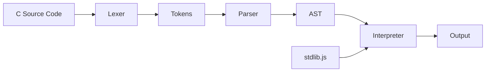

# Woznak Design Document

## Overview

Woznak is a C language emulator implemented in pure JavaScript. It follows a classic compiler/interpreter architecture with three main phases: lexical analysis (tokenization), parsing (AST generation), and interpretation (execution). The library is bundled via Webpack with Terser for minification.

## Architecture



### Pipeline Flow

1. **Input**: Raw C source code string
2. **Lexer**: Tokenizes source into token stream
3. **Parser**: Builds AST from tokens
4. **Interpreter**: Walks AST and executes, using stdlib for built-in functions
5. **Output**: Program output (printf results, return values)

## Components and Interfaces

### src/index.js - Main Entry Point

```javascript
// Public API
const Woznak = {
  run(sourceCode) {},      // Parse and execute C code, return output
  parse(sourceCode) {},    // Parse C code, return AST
  tokenize(sourceCode) {}, // Tokenize C code, return tokens
  version: '1.0.0'
};
```

### src/lexer.js - Tokenizer

Converts C source code into a stream of tokens.

```javascript
// Token types
const TokenType = {
  // Literals
  NUMBER: 'NUMBER',
  STRING: 'STRING',
  CHAR: 'CHAR',
  IDENTIFIER: 'IDENTIFIER',
  
  // Keywords
  INT: 'INT', FLOAT: 'FLOAT', CHAR_TYPE: 'CHAR_TYPE', DOUBLE: 'DOUBLE', VOID: 'VOID',
  IF: 'IF', ELSE: 'ELSE', WHILE: 'WHILE', FOR: 'FOR', RETURN: 'RETURN',
  STRUCT: 'STRUCT', SWITCH: 'SWITCH', CASE: 'CASE', DEFAULT: 'DEFAULT', BREAK: 'BREAK',
  
  // Operators
  PLUS: 'PLUS', MINUS: 'MINUS', STAR: 'STAR', SLASH: 'SLASH', PERCENT: 'PERCENT',
  EQ: 'EQ', NEQ: 'NEQ', LT: 'LT', GT: 'GT', LTE: 'LTE', GTE: 'GTE',
  AND: 'AND', OR: 'OR', NOT: 'NOT',
  AMPERSAND: 'AMPERSAND', PIPE: 'PIPE', CARET: 'CARET', TILDE: 'TILDE',
  LSHIFT: 'LSHIFT', RSHIFT: 'RSHIFT',
  ASSIGN: 'ASSIGN', PLUS_ASSIGN: 'PLUS_ASSIGN', MINUS_ASSIGN: 'MINUS_ASSIGN',
  
  // Delimiters
  LPAREN: 'LPAREN', RPAREN: 'RPAREN',
  LBRACE: 'LBRACE', RBRACE: 'RBRACE',
  LBRACKET: 'LBRACKET', RBRACKET: 'RBRACKET',
  SEMICOLON: 'SEMICOLON', COMMA: 'COMMA', DOT: 'DOT', ARROW: 'ARROW',
  
  EOF: 'EOF'
};

// Token structure
class Token {
  constructor(type, value, line, column) {}
}

// Lexer class
class Lexer {
  constructor(source) {}
  tokenize() {} // Returns Token[]
}
```

### src/parser.js - AST Generator

Builds an Abstract Syntax Tree from tokens using recursive descent parsing.

```javascript
// AST Node types
class ASTNode {
  constructor(type) { this.type = type; }
}

class Program extends ASTNode {
  constructor(declarations) {} // Top-level: functions, global vars, structs
}

class FunctionDeclaration extends ASTNode {
  constructor(returnType, name, params, body) {}
}

class VariableDeclaration extends ASTNode {
  constructor(varType, name, initializer, isArray, arraySize) {}
}

class BinaryExpression extends ASTNode {
  constructor(operator, left, right) {}
}

class UnaryExpression extends ASTNode {
  constructor(operator, operand) {}
}

class CallExpression extends ASTNode {
  constructor(callee, args) {}
}

class IfStatement extends ASTNode {
  constructor(condition, consequent, alternate) {}
}

class WhileStatement extends ASTNode {
  constructor(condition, body) {}
}

class ForStatement extends ASTNode {
  constructor(init, condition, update, body) {}
}

class ReturnStatement extends ASTNode {
  constructor(argument) {}
}

class BlockStatement extends ASTNode {
  constructor(statements) {}
}

class AssignmentExpression extends ASTNode {
  constructor(operator, left, right) {}
}

class ArrayAccess extends ASTNode {
  constructor(array, index) {}
}

class MemberExpression extends ASTNode {
  constructor(object, property, isPointer) {}
}

// Parser class
class Parser {
  constructor(tokens) {}
  parse() {} // Returns Program AST
}
```

### src/interpreter.js - Runtime Execution

Walks the AST and executes the program.

```javascript
// Memory simulation for variables
class Environment {
  constructor(parent) {}
  define(name, value) {}
  get(name) {}
  set(name, value) {}
}

// Simple memory model for pointers/arrays
class Memory {
  constructor() {}
  allocate(size) {}  // Returns address
  read(address) {}
  write(address, value) {}
  free(address) {}
}

// Interpreter class
class Interpreter {
  constructor(stdlib) {}
  
  run(ast) {}           // Execute program, return output
  visit(node) {}        // Dispatch to appropriate visitor
  
  // Visitor methods
  visitProgram(node) {}
  visitFunctionDeclaration(node) {}
  visitVariableDeclaration(node) {}
  visitBinaryExpression(node) {}
  visitUnaryExpression(node) {}
  visitCallExpression(node) {}
  visitIfStatement(node) {}
  visitWhileStatement(node) {}
  visitForStatement(node) {}
  visitReturnStatement(node) {}
  visitBlockStatement(node) {}
  visitAssignmentExpression(node) {}
  visitArrayAccess(node) {}
  visitIdentifier(node) {}
  visitLiteral(node) {}
}
```

### src/stdlib.js - Standard Library

Implements C standard library functions in JavaScript.

```javascript
const stdlib = {
  // I/O
  printf(format, ...args) {},  // Format string and return output
  
  // Math
  abs(x) {},
  sqrt(x) {},
  pow(x, y) {},
  sin(x) {},
  cos(x) {},
  tan(x) {},
  floor(x) {},
  ceil(x) {},
  
  // String (basic)
  strlen(str) {},
  strcmp(s1, s2) {},
  
  // Memory (simulated)
  malloc(size) {},
  free(ptr) {}
};
```

## Data Models

### Token

| Field  | Type   | Description                    |
|--------|--------|--------------------------------|
| type   | string | Token type from TokenType enum |
| value  | any    | Literal value if applicable    |
| line   | number | Source line number             |
| column | number | Source column number           |

### AST Node Base

| Field | Type   | Description          |
|-------|--------|----------------------|
| type  | string | Node type identifier |

### Environment (Scope)

| Field    | Type        | Description              |
|----------|-------------|--------------------------|
| parent   | Environment | Parent scope (or null)   |
| bindings | Map         | Variable name -> value   |

## Error Handling

### Error Types

1. **LexerError**: Invalid characters, unterminated strings
2. **ParseError**: Syntax errors, unexpected tokens
3. **RuntimeError**: Type errors, undefined variables, division by zero

### Error Format

```javascript
class WoznakError extends Error {
  constructor(message, line, column, type) {
    super(`${type} at line ${line}, column ${column}: ${message}`);
    this.line = line;
    this.column = column;
    this.errorType = type;
  }
}
```

## Build Configuration

### webpack.config.js

```javascript
const path = require('path');
const TerserPlugin = require('terser-webpack-plugin');

module.exports = {
  entry: './src/index.js',
  output: {
    path: path.resolve(__dirname, 'dist'),
    filename: 'woznak.min.js',
    library: {
      name: 'Woznak',
      type: 'umd',
      export: 'default'
    },
    globalObject: 'this'
  },
  mode: 'production',
  optimization: {
    minimizer: [new TerserPlugin()]
  }
};
```

### package.json scripts

```json
{
  "scripts": {
    "build": "webpack --config webpack.config.js",
    "serve": "node server.js"
  }
}
```

## Server Configuration

### server.js

Simple Express server serving static files:

```javascript
const express = require('express');
const path = require('path');

const app = express();
const PORT = 3000;

// Serve dist folder at /dist
app.use('/dist', express.static(path.join(__dirname, 'dist')));

// Serve public folder at root
app.use(express.static(path.join(__dirname, 'public')));

app.listen(PORT, () => {
  console.log(`Woznak dev server running at http://localhost:${PORT}`);
});
```

## Test Interface

### public/index.html

```html
<!DOCTYPE html>
<html>
<head>
  <title>Woznak - C Emulator</title>
  <style>
    /* Simple styling for code editor and output */
  </style>
</head>
<body>
  <h1>Woznak - C in JavaScript</h1>
  <textarea id="code" placeholder="Write C code here..."></textarea>
  <button id="run">Run</button>
  <pre id="output"></pre>
  
  <script src="/dist/woznak.min.js"></script>
  <script>
    document.getElementById('run').onclick = function() {
      const code = document.getElementById('code').value;
      const output = document.getElementById('output');
      try {
        const result = Woznak.run(code);
        output.textContent = result;
      } catch (e) {
        output.textContent = 'Error: ' + e.message;
      }
    };
  </script>
</body>
</html>
```

## Testing Strategy

Testing is out of scope for this implementation per requirements. The test interface in `public/index.html` serves as the manual testing mechanism.

## Project File Structure

```
woznak/
├── src/
│   ├── index.js        # Main entry, exports Woznak API
│   ├── lexer.js        # Tokenizer
│   ├── parser.js       # AST generator
│   ├── interpreter.js  # Runtime execution
│   └── stdlib.js       # Standard library
├── public/
│   └── index.html      # Test interface
├── dist/
│   └── woznak.min.js   # Built output (generated)
├── server.js           # Dev server
├── webpack.config.js   # Webpack configuration
├── package.json        # Project config
└── README.md           # Documentation
```
